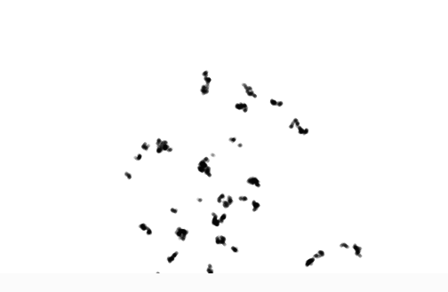
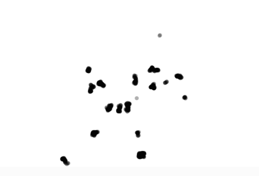

# Distribución personalizada: Lévy flight
[enlace al tema](https://natureofcode.com/random/#a-custom-distribution-of-random-numbers)
## ¿En qué consiste el concepto de Lévy flight?
Consiste en cada cierto tiempo dar pasos más largos de lo acostumbrado en una caminata aleatoria estándar, para evitar que vuelva en sus pasos y repita posiciones en las que ya había estado múltiples veces. Esto requiere un set de probabilidades personalizado, que podría ser, mientras más largo el paso, menos probable es que salga y mientras más corto el paso, más probable es que salga.
## ¿En qué casos sería interesante usarlo?
Sería interesante y acertado usarlo para modelar ciertos tipos de comportamiento como:
- Búsqueda eficiente: como el mismo libro dice, en búsqueda de comifa, este patrón maximiza la eficiencia en la búsqueda de comida, ya que cubre grandes áreas en poco tiempo.
- Dispersión de partículas: por ejemplo, al tratar de emular el movimiento de semillas transportadas por el viento o los insectos pueden seguir un patrón de Lévy para maximizar su dispersión.
- Simulación de NPCs en juegos: sería interesante ver personajes que sigan un movimiento aleatorio un poco diferente al de la mayoría.
- Generación de entornos y exploración procedural: En juegos de mundo abierto, los patrones de Lévy pueden definir caminos naturales en terrenos o generar distribuciones más realistas de objetos y eventos.
## Código de la simulación
``` js
let x, y; // Posición inicial del punto

function setup() {
  createCanvas(640, 400);
  background(255);
  x = width / 2;
  y = height / 2;
}

function draw() {
  let r = random(1);
  
  // Paso pequeño o grande
  let xstep, ystep;
  if (r < 0.01) {
    xstep = random(-100, 100);
    ystep = random(-100, 100);
  } else {
    xstep = random(-1, 1);
    ystep = random(-1, 1);
  }
  
  // Actualizar posición
  x += xstep;
  y += ystep;

  // Dibujar el punto grande
  fill(0, 0, 0, 30); // color del trazo con opacidad baja para visualizar mejor la repetición de puntos.
  noStroke();
  ellipse(x, y, 4, 4); // Tamaño ajustable
}
```
## Captura de pantalla


