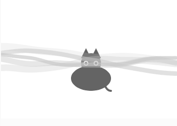
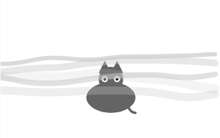

# Ruido Perlin
## Explicación de la figura 0.4: “A graph of Perlin noise values over time (left) and of random noise values over time (right)”
En ambas gráficas, el eje x representa el tiempo y el eje y representa el número aleatorio. En la gráfica de la izquierda se visualiza el ruido de Perlin como suaves transiciones entre un número y los que le siguen, tanto así que se ve muy redondeada. En la gráfica de la derecha se visualiza el ruido normal, el cual se da por la generación de números aleatorios que no siguen patrón alguno, lo que resulta en toscas y filudas transiciones entre números.
## Aplicación con ruido Perlin
### ¿Cómo se usó el ruido Perlin para generar las variaciones?
El ruido Perlin se usa en la niebla, que fue una de las aplicaciones que consulté. La niebla se desplaza teniendo en cuenta el ruido Perlin para un mejor efecto y naturalidad. Cada tira de niebla tiene un desplazamiento y ruido ligeramente diferente.
### Código
``` js
let t = []; // Tiempos individuales para cada capa de niebla
let numLayers = 5; // Número de capas de niebla

function setup() {
  createCanvas(360, 240);
  
  // Inicializar diferentes tiempos para cada capa
  for (let i = 0; i < numLayers; i++) {
    t.push(random(1000)); // Semilla aleatoria para cada capa
  }
}

function draw() {
  background(255);

  // Dibujar el gato
  drawCat(width / 2, height - 80);

  // Dibujar múltiples capas de niebla
  for (let i = 0; i < numLayers; i++) {
    drawFogLayer(t[i], i);
    t[i] += 0.002 + i * 0.002; // Velocidad diferente para cada capa
  }
}

function drawCat(x, y) {
  fill(100);
  noStroke();
  
  // Cuerpo
  ellipse(x, y, 80, 50);
  
  // Cabeza
  ellipse(x, y - 30, 40, 40);
  
  // Orejas
  triangle(x - 20, y - 40, x - 10, y - 60, x, y - 40);
  triangle(x + 20, y - 40, x + 10, y - 60, x, y - 40);
  
  // Ojos
  fill(255);
  ellipse(x - 10, y - 30, 10, 10);
  ellipse(x + 10, y - 30, 10, 10);
  
  fill(0);
  ellipse(x - 10, y - 30, 5, 5);
  ellipse(x + 10, y - 30, 5, 5);
  
  // Cola
  noFill();
  stroke(100);
  strokeWeight(4);
  arc(x + 40, y, 30, 50, HALF_PI, PI);
}

function drawFogLayer(t, layerIndex) {
  let xoff = t; 
  let opacity = map(layerIndex, 0, numLayers, 50, 200); // Opacidad diferente por capa
  
  noFill();
  stroke(200, opacity);
  strokeWeight(15 - layerIndex * 2); // Variar grosor para capas más suaves

  beginShape();
  for (let x = 0; x < width; x += 10) {
    let y = noise(xoff) * height * 0.5 + height * 0.3; // Variar altura de la niebla
    xoff += 0.02; 
    vertex(x, y);
  }
  endShape();
}
```
### Captura de pantalla


