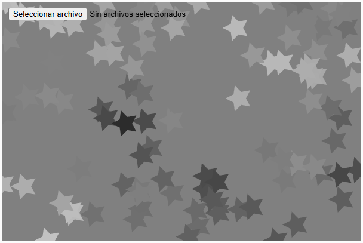
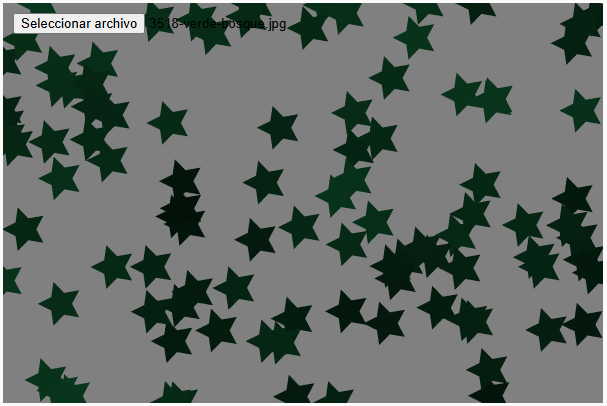
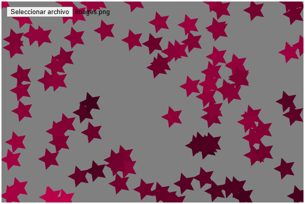
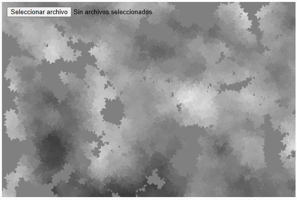
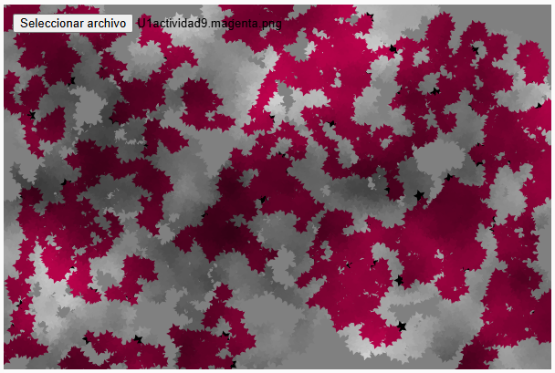
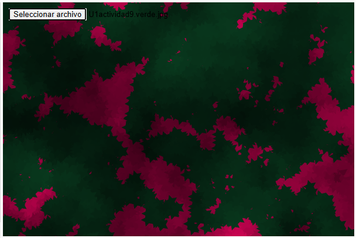

# Materialización
## Primera versión
### Código
``` js
let columnas, filas;
let escala;
let img;
let colorPromedio;
let inputButton;
let walkers = []; // Array para almacenar los objetos Walker

function setup() {
    createCanvas(600, 400);
    inputButton = createFileInput(handleFile);
    inputButton.position(10, 10);
    escala = floor(random(5, 30));
    columnas = width / escala;
    filas = height / escala;

    // Inicializar los objetos Walker
    for (let i = 0; i < 100; i++) { // Crear 100 caminantes
        walkers.push(new Walker(random(width), random(height)));
    }
}

function draw() {
    background(128);
    if (img) {
        img.loadPixels();
        colorPromedio = calcularColorPromedio();
    }

    for (let walker of walkers) {
        walker.walk(); // Ejecutar un paso de caminata aleatoria
        walker.display(); // Dibujar la estrella en la posición del caminante
    }
}

function keyPressed() {
    if (key.toLowerCase() === 's') {
        escala = floor(random(5, 30));
        columnas = width / escala;
        filas = height / escala;

        // Reinicializar los objetos Walker con la nueva escala
        walkers = [];
        for (let i = 0; i < 100; i++) {
            walkers.push(new Walker(random(width), random(height)));
        }
    }
}

function handleFile(file) {
    if (file.type === 'image') {
        img = loadImage(file.data);
    }
}

function calcularColorPromedio() {
    let r = 0, g = 0, b = 0, total = 0;
    for (let y = 0; y < img.height; y += 10) {
        for (let x = 0; x < img.width; x += 10) {
            let index = (x + y * img.width) * 4;
            r += img.pixels[index];
            g += img.pixels[index + 1];
            b += img.pixels[index + 2];
            total++;
        }
    }
    return color(r / total, g / total, b / total);
}

// Clase Walker para representar a cada caminante
class Walker {
    constructor(x, y) {
        this.x = x;
        this.y = y;
    }

    walk() {
        let stepX = random(-escala, escala); // Paso aleatorio en el eje X
        let stepY = random(-escala, escala); // Paso aleatorio en el eje Y

        this.x = constrain(this.x + stepX, 0, width); // Mantener dentro de los límites del canvas
        this.y = constrain(this.y + stepY, 0, height); // Mantener dentro de los límites del canvas
    }

    display() {
        let ruidoValor = noise(this.x * 0.01, this.y * 0.01); // Usar ruido para variar el color
        let brillo = map(ruidoValor, 0, 1, 0, 255);
        fill(lerpColor(colorPromedio || color(255), color(0), brillo / 255));
        noStroke();
        drawStar(this.x, this.y, escala / 2, escala); // Dibujar la estrella
    }
}

// Función para dibujar una estrella
function drawStar(x, y, radius1, radius2) {
    let angle = TWO_PI / 5;
    beginShape();
    for (let i = 0; i < 5; i++) {
        let sx = x + cos(i * angle) * radius1;
        let sy = y + sin(i * angle) * radius1;
        vertex(sx, sy);
        let ex = x + cos((i + 0.5) * angle) * radius2;
        let ey = y + sin((i + 0.5) * angle) * radius2;
        vertex(ex, ey);
    }
    endShape(CLOSE);
}
```
### Resultado

 




[Enlace a la simulación](https://editor.p5js.org/SofiaLezcanoArenas/sketches/vx59hHNrv)

## Versión final
La diferencia con esta versión, es que al fondo pintarse únicamente al comienzo del programa y no reiteradas veces a lo largo de él, las estrellas parecen pintando un lienzo y no moviéndose rápidamente por un lugar.
### Código

### Resultado




[Enlace a la simulación](https://editor.p5js.org/SofiaLezcanoArenas/sketches/En7ncYwzF)
